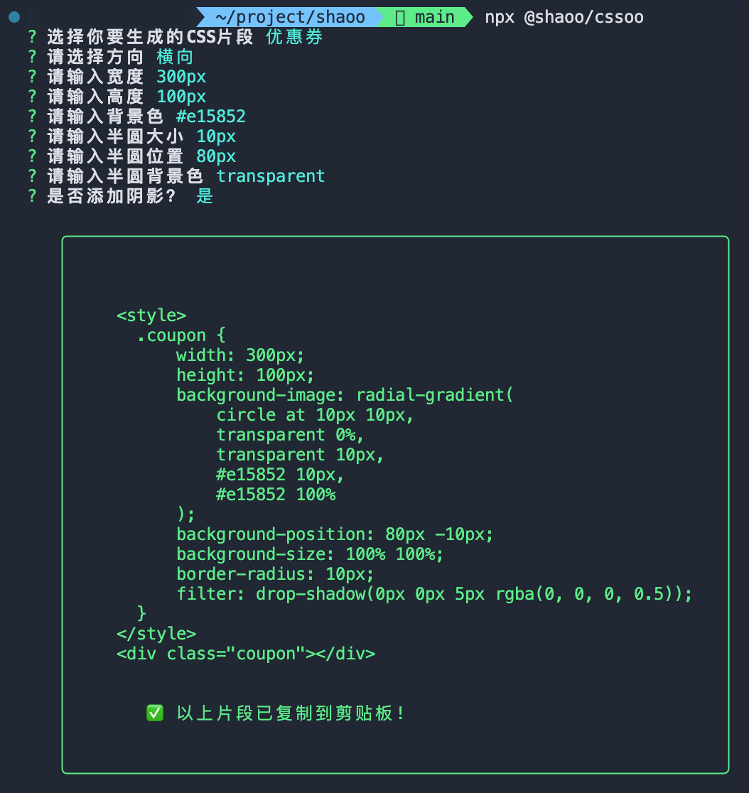

# cssoo

> 根据输入的参数生成常用的 CSS 代码片段，包括 优惠券、三角形、单行省略、多行省略等


&nbsp;

&nbsp;

&nbsp;

&nbsp;

## 预览



## 使用

```shell
npx @shaoo/cssoo
```

## 注意

如果 cssoo 升级了版本，但使用 npx 命令安装的版本还是旧版本，需要先清除 npx 缓存

```shell
npx clear-npx-cache
```

## 已支持片段

1. 优惠券

```html
<style>
  .coupon {
    width: 240px;
    height: 100px;
    background-image: radial-gradient(
      circle at 8px 8px,
      transparent 0%,
      transparent 8px,
      #e15852 8px,
      #e15852 100%
    );
    background-position: 66px -8px;
    background-size: 100% 100%;
  }
</style>
<div class="coupon"></div>
```

## 待支持片段

1. 三角形 上 下 左 右

2. 单行溢出省略号

3. 多行溢出省略号

4. 修改滚动条样式

5. 0.5px 边框 上下 左右 全部
